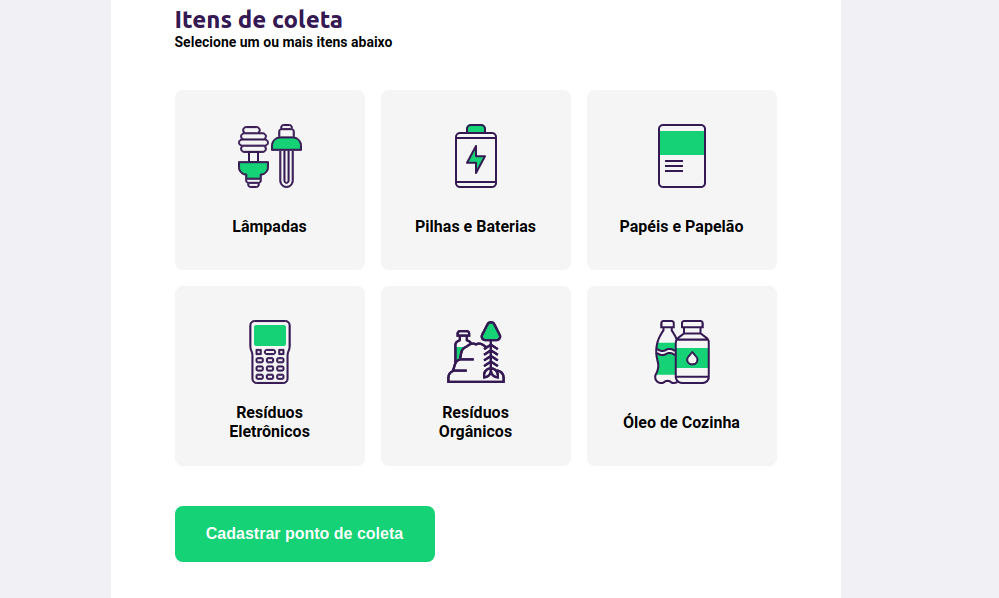
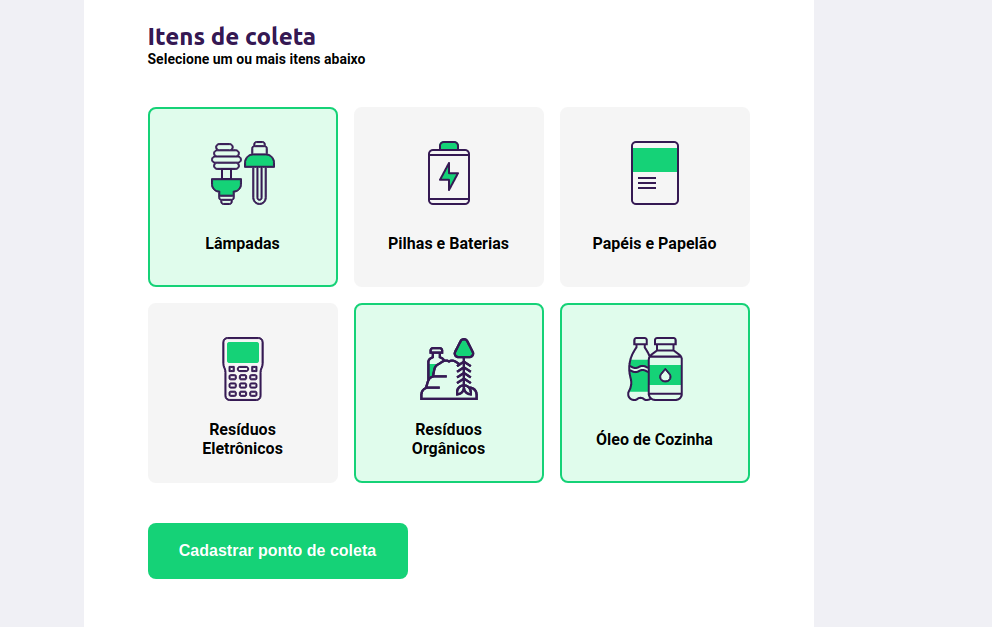
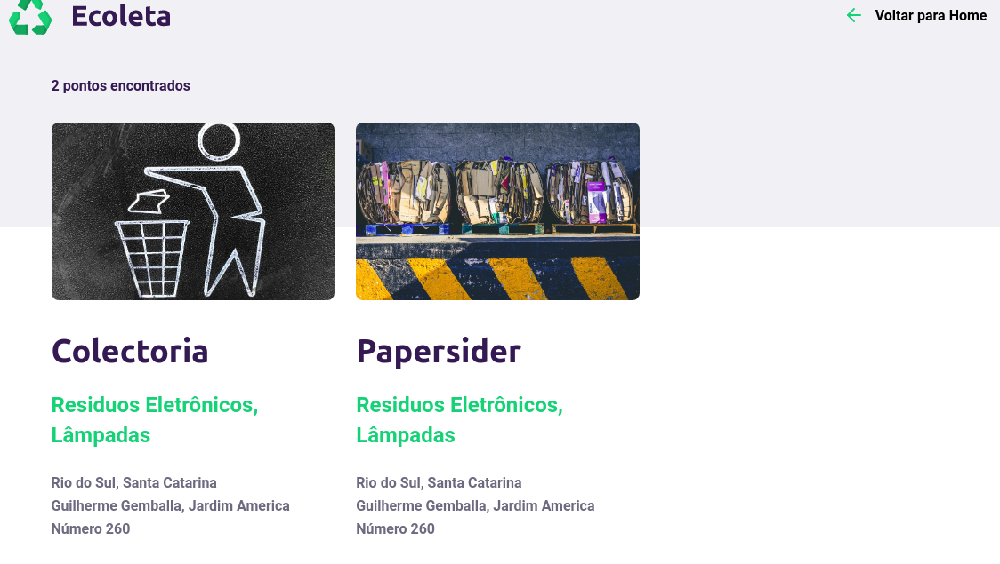

# Projeto Ecoleta
Projeto de aprendizagem da Semana Next Level Week. By 


# Mas o que é a Next Level Week ? 

A NLW (Next Level Week), é um evento online com conteúdo prático, desafios e hacks para ajudar devs (desenvolvedores) como eu, a avançar ao próximo nível.


# Sobre o Projeto 

O Ecoleta é um projeto criado para gerenciar o processo de coleta de resíduos nas cidades do Brasil. Com ele é possível encontrar o ponto de coleta mais próximo de você ou cadastrar um novo ponto de coleta.

# Como rodar na sua máquina:

1- Primeiro abra um Terminal na pasta do projeto. (Se estiver usando Windows, recomendo usar o Git-Bash para isso)

2- Dentro do terminal digite ```npm install``` , ele irá instalar todas as dependências do projeto.

3- Após a instalação das dependências digite ```npm start``` , ele vai iniciar um servidor node na porta 3000.

4- Abra seu navegador e na barra de busca lá em cima digite "localhost:3000". Pronto o site irá ser aberto e você poderá desfrutar dele.


# Meu aprendizado (dia 1):

dia 1 - Hoje é o primeiro dia do NWL, vi coisas que me assustavam até por em prática hoje, usando html e css, consegui desenvolver minha primeira página web! Fiquei surpreso comigo mesmo com o resultado de hoje, fiquei fascinado com toda aquela tecnologia que coloquei em prática hoje. Espero Ansiosamente pela próxima aula com o excelente professor Mayk Brito.

###  Screenshot do que fiz hoje:


# Meu aprendizado (dia 2):

dia 2 - Segundo dia da NWL, hoje explorei mais ainda a parte de css e html, adicionando agora o javascript na aplicação, entendi conceitos que eram complexos pra mim. Creio que foi um dia produtivo hoje.

###  Screenshot do que fiz hoje:


# Meu aprendizado (dia 3):

dia 3 - Hoje usei mais css, agora para colocar os ícones na pagina de cadastro e também
para criar a pagina onde fica os pontos cadastrados. Gostei muito do que fizemos hoje,
me aperfeiçoei mais em css e acredito estar indo no caminho certo!

###  Screenshots do que fiz hoje:

 



# Meu aprendizado (dia 4):

dia 4 - Hoje tive meu primeiro contato com nodejs e outras dependências, aprendi a utilizar o nunjukes, para deixar o código mais limpo. Aprendi a iniciar um servidor com nodejs, confesso que foi uma experiência incrível ver tudo aquilo funcionando!

# Meu aprendizado (dia 5):

dia 5 - Quinto e ultimo dia da NWL, hoje tive o meu primeiro contato com banco de dados usando sqlite3, foi um pouco confuso no comeco, mas agora depois de rever o código, creio ter entendido. Ajeitamos o mecanismo de busca dos pontos de coleta para pesquisar por cidades de verdade e adicionamos uma tela de "Cadastro Concluído" quando termina de cadastrar o ponto de coleta.

--

Essa semana foi incrível! Foram tantas coisas que aprendi e aperfeiçoei que fiquei espantado com tanto progresso. Infelizmente acabou e quero deixar meu feedback aqui para essa semana do NWL, que foi algo que mudou a minha visão e me deu um rumo para seguir. Espero ansiosamente pela próxima NWL! Obrigado Rocketseat por proporcionar essa experiencia.

###  Screenshot do que fiz hoje:

 