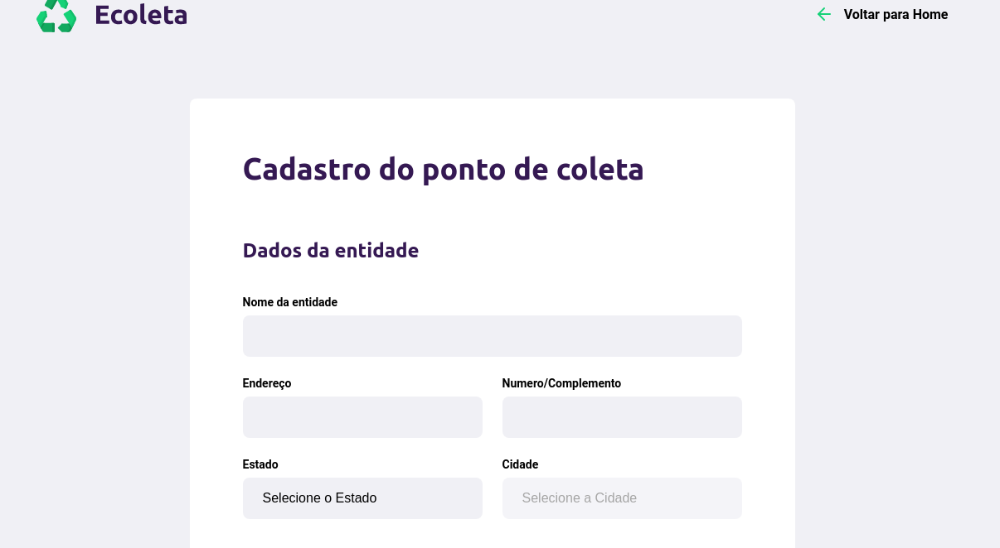

# Projeto Ecoleta
Projeto de aprendizagem da Semana Next Level Week. By 

-

# Mas o que é a Next Level Week ? 

A NLW (Next Level Week), é um evento online com conteúdo prático, desafios e hacks para ajudar devs (desenvolvedores) como eu, a avançar ao próximo nível.

-

# Sobre o Projeto 

O Ecoleta é um projeto criado para gerenciar o processo de coleta de resíduos nas cidades do Brasil. Com ele é possível encontrar o ponto de coleta mais próximo de você ou cadastrar um novo ponto de coleta.

-

# Meu aprendizado (dia 1):

dia 1 - Hoje é o primeiro dia do NWL, vi coisas que me assustavam até por em prática hoje, usando html e css, consegui desenvolver minha primeira página web! Fiquei surpreso comigo mesmo com o resultado de hoje, fiquei fascinado com toda aquela tecnologia que coloquei em prática hoje. Espero Ansiosamente pela próxima aula com o excelente professor Mayk Brito.

###  Screenshot do que fiz hoje:

--

# Meu aprendizado (dia 2):

dia 2 - Segundo dia da NWL, hoje explorei mais ainda a parte de css e html, adicionando agora o javascript na aplicação, entendi conceitos que eram complexos pra mim. Creio que foi um dia produtivo hoje.

###  Screenshot do que fiz hoje:

